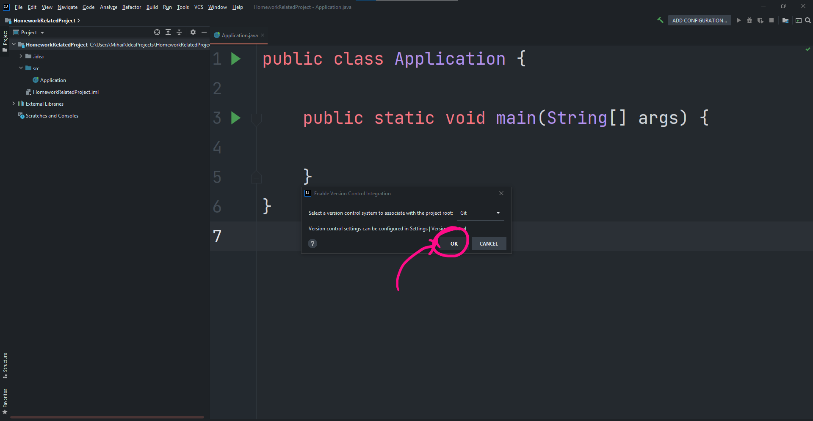
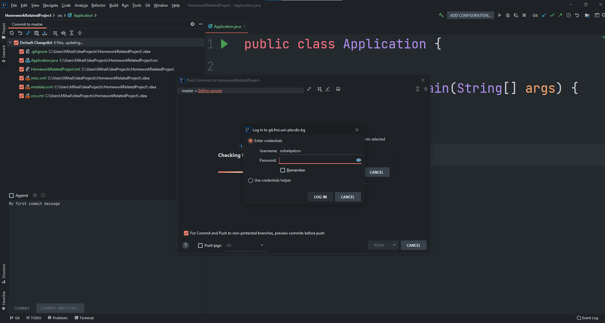

# Среща 10 - Връщане на стойност от метод
 #### 💡 - Какво разгледахме днес
- Въведение в Git / работа с VCS
- Работа със switch
- Връщане на стойности от методи

 #### 📚 - Ресурси и материали
- [Видео от срещата](https://www.youtube.com/watch?v=PlTkdWKS9rY&list=PLyZOguednhL7C1GkRRIMZ7P5d6UQ0cT8D&index=10)
- [Сорс код от срещата](./source/)

 #### 🕹️ - Задачи за упражнения
- [Работа в час](./cw/README.md)

## **Качване на домашното от InteliJ в GitHub**

Работим си спокойно по нашите задачи без да бързаме и без напрежение. Става време да си качим кода в GitLab-a.

Изберете **VCS** -> **Enable Version Control Integration**


Потвърдете, че ще ползвате **Git** като основна система за управление на версиите и натиснете **Ok**



В този момент всичките ви файлове, които все още не са добавени към системата за управление на версиите ще светнат в различен цвят


За да добавите, кода си в Git трябва:  
- да селектирате директорията на проекта с ляв бутон
- да натиснете десен бутон
- да намерите менюто **Git**
- да изберете командата **Add**


Ще забележите, че веднъж добавени, файловете стават зелени. 


В момента кода ви не е качен в GitLab проекта, който направихме. За да го направите:
- изберете командата **commit**
- уверете се че промените, които сте направени са отразени коректно. не се притеснявайте, че има доста файлове, които не сте писали вие. Те са част от финалната програма
- Напишете съобщение, което да информира системата за вашите промени
- Натиснете бутона **Commit and push**


Необходимо е да въведем URL адреса на GITLAB проекта, в който искаме да качим кода си


Също така въвеждаме паролата си за достъп



Ако всичко е точно трябва да видите, нещо което прилича на следния екран. Избираме **Push** и кода се качва успешно


Процедурата се повтаря всеки път когато нанесете нови промени по вашия код.

## Работа със **switch**

Като алтернатива на If/else логиката, можем да използваме специфична конструкция за избор на операция известна като **SWITCH**. При нея спазваме следната последователност:
- като условие се използва стойността на променливата (за разлика от IF който получава само и единствено израз от булев тип), низова или числова
- всяко едно от проверяваните условия се сравнява с условието **case**

```java
switch (objectId) {

    case 1:
        System.out.println("Go Sideway");

    case 2:
        System.out.println("Jump");

    case 3:
        System.out.println("Go Forward");
}
```

Важно е да се знае, че производствен дефект на Java гарантира че след успешно изпълнение на някои от опциите, всички останали ще бъдат изпълнени автоматично, след опцията, която е избрана. Така например ако условно изберем **case 1 ** - ще получим всички възможни отговори. 

> Go Sideway
> 
> Jump
> 
> Go Forward

Единствения вариант, да елиминираме тази нелогичност е да използваме ключовата дума **break** , която ще спре изпълнението на SWITCH условната конструкция

```java
switch (objectId) {
    case 1:
        System.out.println("Go Sideway");
        break;

    case 2:
        System.out.println("Jump");
        break;

    case 3:
        System.out.println("Go Forward");
        break;
}
```

Ако никой от изброените условия не бъде избрано, но въпреки това искаме да дефинираме изход от операцията, можем да използваме ключовата дума **default**. В този контекст, ако при избраната конструкция имаме **objectId** със стойност различна от 1 / 2 или 3 ще получим стойност.

> *** Repeat ***

```java
switch (objectId) {
    case 1:
        System.out.println("Go Sideway");
        break;

    case 2:
        System.out.println("Jump");
        break;

    case 3:
        System.out.println("Go Forward");
        break;

    default:
        System.out.println("*** Repeat ***");
}
```

## Връщане на стойности от методи

Вече установихме че има два вида метода в зависимост от стойностите, които връщат 
- void методи - които не връщат стойност
- всички оставали методи :D 

Та втория тип е темата на днешното ни резюме. Мистериозната дума **void** е служебния начин, по който Java казва, че метода не прави нещо друго освен, да съхранява изрази и конструкции. 

Нека да преговорим идеята на методите:
- организират кода, на малки преизползваеми парченца;
- елиминират дуплициране на кода.

Ще добавим още един елемент към този миск а именно, опаковане на връщан резултат. Така например, ако искаме да създадем сложна логика, която да може да връща стойността си на произволно място, то можем да дефинираме експлицитен метод, който да го прави

```java
public static boolean isBatteryCharged() {

    int availableHitCount = 4;
    return (availableHitCount != 0);
}
```

Методите, които връщат стойност могат, да се използват в дясната част на произволен израз, (присвояване)

```java
boolean isProcessable = isBatteryCharged();
```
