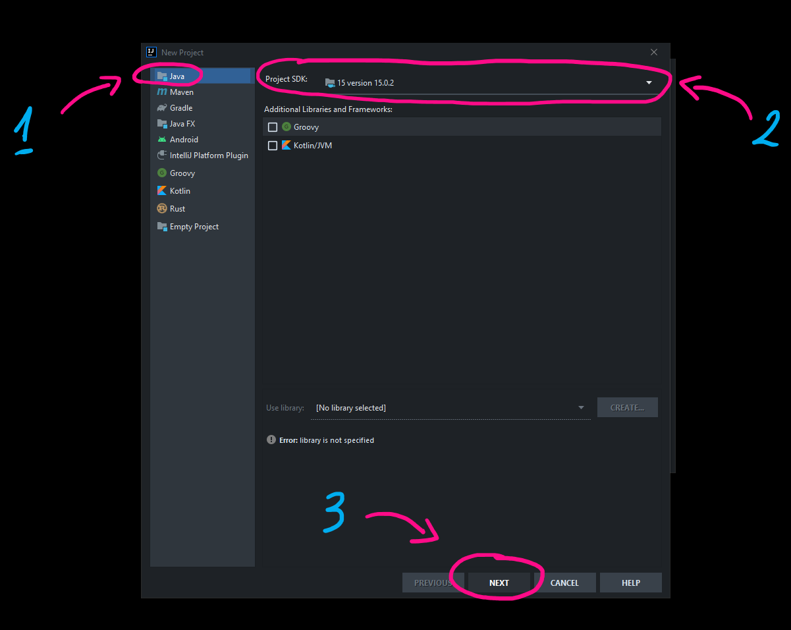
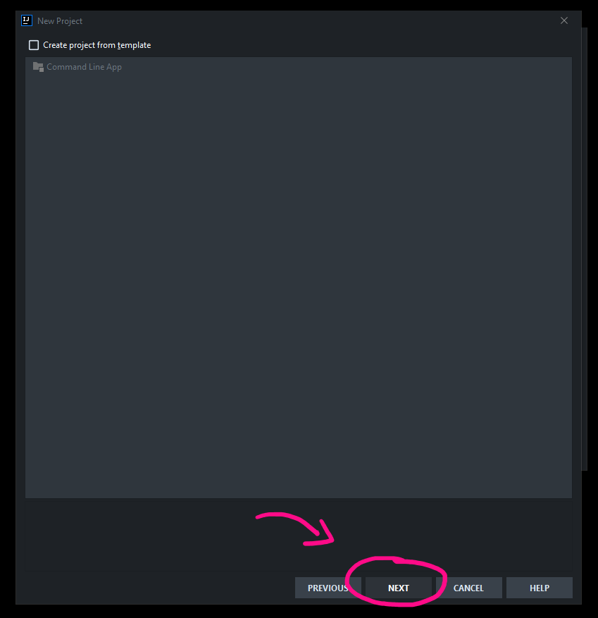
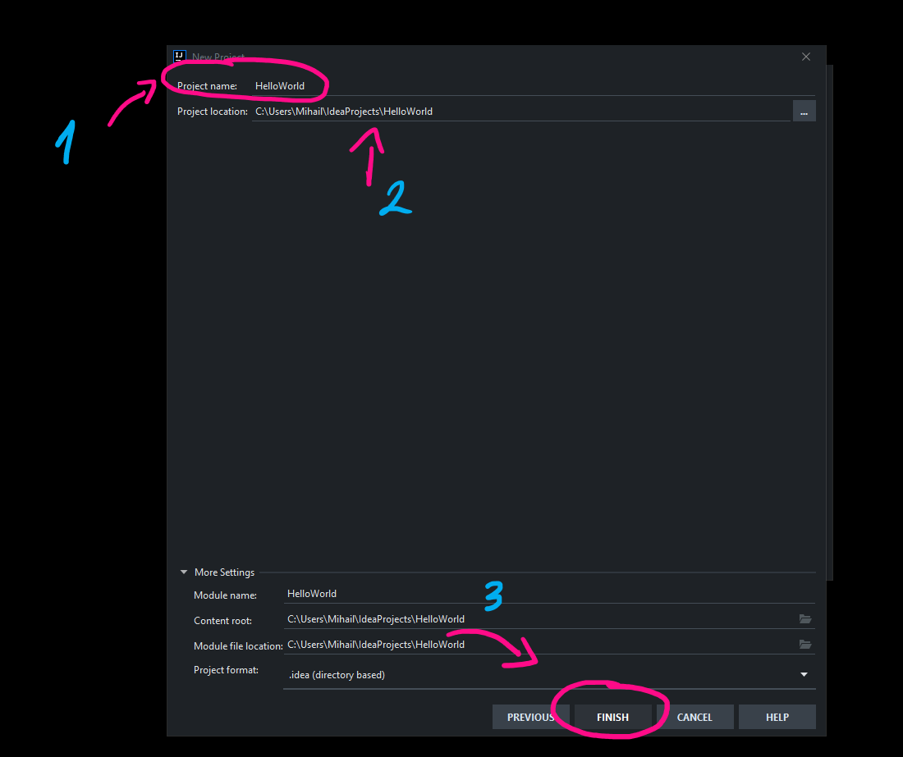
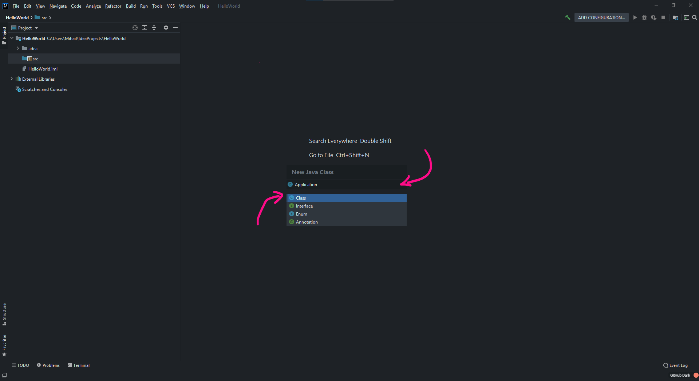

# Въведение в Java

## $какво разгледахме днес ?
- инсталация на JDK
- инсталация на InteliJ Idea
- създаване на първата ни програма

## $други ресурси
- [видео](https://drive.google.com/file/d/1xg0215OxhnbvIO8UBnDZUxPGPj_C-ufC/view?usp=sharing)
- [сорс код](https://github.com/mihail-petrov/netit-webdev-java/tree/master/22-23/%40semester_1/week-01-1/source)

# Създаване на първата ни програма

Създаването на първа програма на нов език за програмиране е винаги вълнуващо. Ще използваме InteliJ IDEA като основен редактор, при разработка на приложенията ни, но основната идея, която ще опишем важи за всички инструменти, които предоставят еквивалентна функционалност.

## Създаване на нов проект

Отворете InteliJ и изберете **New Project**


Уверете се че:
- е избран типът на проекта да бъде Java
- както и версията на Java компилатора

Изберете бутона **Next** и продължете към следващия екран.



Ще ви посрещне мрачен и потенциално изпразнен от съдържание екран, в рамките на който няма какво да правите. Изберете бутона **Next**.



Време е да кръстим проекта си по подходящ начин. Имайте предвид следните важни моменти:
- името на проекта по традиция отразява идеята на проекта. В нашия случай той ще бъде HelloWorld;
- като конвенция при изписване на проекта се използва PascalCase - всяка една от думичките, започва с главна буква.

Уверете се че проекта се намира, в подходящата директория. Обикновенно InteliJ създава собствена проектна директория в която съхранява всички новосъздадени проекти. 

Изберете бутона **Next** и продължете към следващия екран.



## Създаване на първия ни клас

Ако успешно сте следвали, стъпките до момента трябва да видите, следния екран. В дясната част на InteliJ е позиционирана директориината структура на проекта. 


Забележете синята папка **src**. В нея ще съхраняваме целия код на нашата бъдеща програма.
- селектирайте с ляв бутон на мишката папката **src**
- с десен бутон на мишката изберете менюто **New**
- изберете **Java Class**


В появилият се прозорец се уверете че е избрана опцията **Class**, след което въведете името на вашия клас. Ще го кръстим **Application**.Имайте предвид следните важни моменти:
- Всички класове в Java започват с **главна буква** и спазват PascalCase конвенцията
- Имената на класовете по традиция идентифицират предмет / идея

 Натиснете **Enter** и създайте класа.



Системата автоматично ще генерира, нов клас **Applicatiobn**.


В момента сме на етап разработка на конзолни приложения. Всяко едно такова приложение, трябва задължително да включва специален метод наречен **main**, който се изписва по специален начин.

```java
public static void main(String[] args) {

}
```
След като приключите с изписването на метода, магически от небитието на софтуерния инструментариум, ще се появи специален зелен бутон, с формата на **триъгълник**. Този бутон е отговорен за стартирането на програмата. 


Нека да видим целия процес последователно


